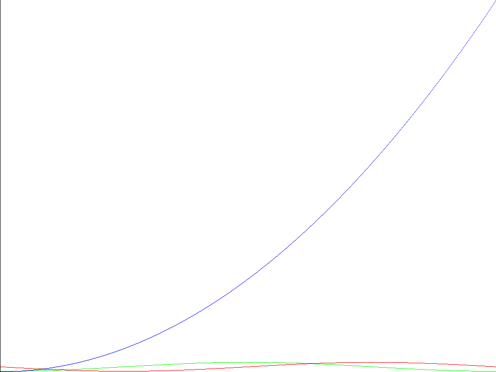
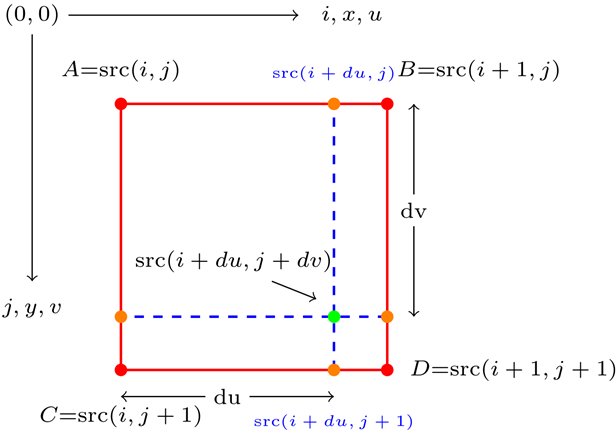
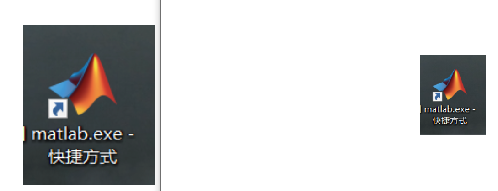

### 											图像处理第一次作业报告    

​												 姓名：杨东谕  学号：3017218173  日期：2019年11月14日

----

#### 作业一

- **摘要**
  $$
  使用matlab绘制一幅(0,2\pi)上的彩色函数图像，其中红色表示正弦波，绿色为余弦波，蓝色为y=x^2图像。
  $$

- **实现过程**

  - 首先创建一个imgH * imgN 的零矩阵用于存放结果图像，将每个点的像素值改为（255,255,255）即纯白背景。

    ```matlab
    img = zeros(imgH,imgW,3);
    for i = 1:3
        img(:,:,i)= 255;
    end
    ```

  - 接着记录各个图像在（0，2π）上的函数值。

    ```matlab
    x = 0: 2*pi/imgW: 2*pi; 
    red = sin(x);
    green = cos(x);
    blue = x.^2;
    ```

  - 将每个图像上函数值取整并映射到图片的高imgH上，以正弦函数为例。
    $$
    red ∈ (-1,1)\\
    1-red /2∈(0,1)\\
    (1-red)/2*(imgH - 1) +1∈（1，imgH)
    $$

    ```matlab
    %注意这里除（4 * pi *pi）是因为y = x^2的图像作为单位时，sin和cos函数的函数值为其 （4 * pi *pi）分之一。
    red = (1-red)/2*(imgH / (4 * pi * pi) - 1)+1;
    red = imgH - red;
    red = round(red);
    green = (1-green)/2*(imgH / (4 * pi * pi) - 1)+1;
    green = imgH - green;
    green = round(green);
    maxb = max(blue);
    minb = min(blue);
    blue = (maxb - blue) / (maxb - minb) * (imgH -1) + 1;
    blue = round(blue);
    ```

  - 将x也同样映射到imgW上，用计算好的位置信息（x,red)来计算每个像素点的颜色值。

    ```matlab
    % 把x映射到图片的宽
    x = 1 : imgW;
    for i = 1: imgW
        %绘制每个像素点的颜色
        img(red(i),x(i),2) = 0;
        img(red(i),x(i),3) = 0;
        img(green(i),x(i),1) = 0;
        img(green(i),x(i),3) = 0;
        img(blue(i),x(i),1) = 0;
        img(blue(i),x(i),2) = 0;
    end
    ```

- **结果**

  - 绘制了1024*768分辨率的函数图像，可以看出函数之间比例关系正确。

  


#### 作业2

- **摘要**

  使用matlab不使用for循环利用双线性插值，对图像进行放缩。未能实现不使用for循环的算法，只使用了普通算法。

- 实现过程

  - 读取图像的高、宽和通道数，并创建一个新的图像矩阵，新图像的高和宽均为原图像的factor倍。

    ```matlab
    	img = imread(origin);
        
        %得到原图像的高宽和通道数
        [height, width, channel] = size(img);
        
        %设置新的长宽为之前的factor倍
        new_height = round(height * factor);
        new_width = round(width * factor);
        
        new_image = zeros(new_height, new_width,channel);
    ```

  - 使用放缩矩阵的逆变换由新的图像获得原图像对应的像素坐标。
    $$
    \left[
     \begin{matrix}
       factor & 0 & 0 \\
       0 & factor & 0 \\
       0 & 0 & 1
      \end{matrix}
      \right] *
     \left[
     \begin{matrix}
     old-height\\
     old-width\\
     channel
     \end{matrix}
     \right] =
     \left[
     \begin{matrix}
     new-height\\
     new-width\\
     channel
     \end{matrix}
     \right]
    $$

    ```matlab
    scale_matrix = [factor, 0 ,0 ; 0 ,factor, 0; 0, 0, 1];
    ```

  - 首先获得包围新像素点的四个像素点（注意边界检测），然后根据双线性插值的计算公式获得新图像的像素信息。

    

    
    $$
    src(i+du,j+du) = (1-du)*(1-dv)*A + (1-dv)*du*B + \\(1-du)*dv*C+du*dv*D
    $$

    ```matlab
     for i = 1 : new_height
            for j = 1 : new_width
                %获得原图的坐标点
                old_pixel = [i,j,1]/scale_matrix;
                
                du = old_pixel(2) - floor(old_pixel(2));
                dv = old_pixel(1) - floor(old_pixel(1));
                %处理边界条件
                if old_pixel(1) < 1
                   old_pixel(1) = 1;
                end
                if old_pixel(1) > height
                   old_pixel(1) = height;
                end
                
                if old_pixel(2) < 1
                   old_pixel(2) = 1;
                end
                if old_pixel(2) > width
                   old_pixel(2) = width;
                end
                
                %上下左右四个点
                left_up=[floor(old_pixel(1)),floor(old_pixel(2))];
                left_down=[ceil(old_pixel(1)),floor(old_pixel(2))];
                right_up=[floor(old_pixel(1)),ceil(old_pixel(2))];
                right_down=[ceil(old_pixel(1)),ceil(old_pixel(2))];
                
                %两次插值计算新图像中的每个Pixel
                new_img(i,j,:) = (1-du)*(1-dv)* img(left_up(1),left_up(2),:) ...
                    + du * (1-dv)*img(right_up(1),right_up(2),:) ...
                    + (1-du)*dv*img(left_down(1),left_down(2),:) ...
                    + du*dv * img(right_down(1),right_down(2),:);
            end
        end
    ```

    

- **结果**

  成功将原图像放大至原来的两倍，结果如下：

  

