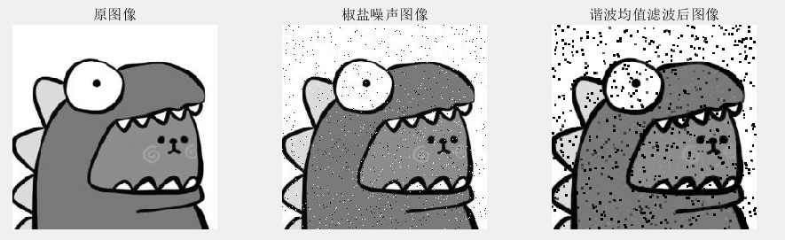
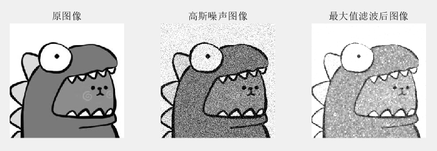
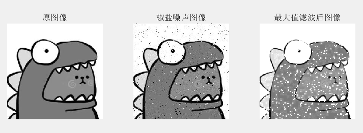

### 											图像处理第二次作业报告    

​												 姓名：杨东谕  学号：3017218173  日期：2019年12月2日

----

- **摘要**

  为图像增加高斯噪声和椒盐噪声，并手动实现算术均值滤波器、几何均值滤波器、谐波均值滤波器、逆谐波均值滤波器四种均值滤波器；中值滤波器、最大值滤波器、最小值滤波器、中点滤波器、修正后的阿尔法均值滤波器五种统计排序滤波器；自适应局部噪声消除滤波器和自适应中值滤波器两种自适应滤波器。对滤波前后的图像进行对比分析。

- **实现过程**

  - 增加噪声

    利用matlab自带的imnoise函数增加均值为0，方差为0.02的高斯噪声和密度为0.02的椒盐噪声。结果保存在Gaussian.jpg和salt&pepper.jpg中。

    ```matlab
    function [] =  addNoise(img_name)
    img = imread(img_name);
    img = im2double(img);
    img = rgb2gray(img);
    imwrite(img, 'gray.jpg');
    %添加椒盐噪声 
    noise_picture = double(imnoise(img,'salt & pepper',0.02));
    %imshow(noise_picture)
    imwrite(noise_picture,'salt&pepper.jpg');
    %添加高斯噪声
    noise_picture = double(imnoise(img,'gaussian',0,0.02));
    %imshow(noise_picture)
    imwrite(noise_picture,'gaussian.jpg');
    ```

    

  - 算数均值滤波器

    

    1.首先为原噪声图像增加一圈边界，目的是解决在卷积操作时的边界情况。在增加边界时采用与相邻的像素相同的方法。（之后的滤波器均采用这一方法，后不再写出）

    ```matlab
    [height,width] = size(img);
    %加一圈边缘
    add_edge = zeros(height+2, width+2);
    add_edge(2:1+height,2:1+width) = img;
    %imshow(add_edge(2:1+height,2:1+width));
    
    %加上边缘
    add_edge(1,2:1+width) = img(1,1:width);
    %加下边缘
    add_edge(height+2,2:1+width) = img(height,1:width);
    %加左边缘
    add_edge(1:height+2,1) = add_edge(1:height+2,2);
    %加右边缘
    add_edge(1:height+2,width+2) = add_edge(1:height+2,width+1);
    ```

    2.设置3*3的卷积核，利用双重循环，每次取增加边界后的噪声图像中的3\*3子图像，用9个像素的均值代替中间的像素。最后排除边界取中间的图像即可获得去噪后的图像。(之后滤波器的做法相同，只是计算中间像素的方式不同，后不再赘述)

    ```matlab
    m = 3;
    n = 3;
    res = add_edge;
    for i=1:h-m+1
        for j=1:w-n+1
            sub = add_edge(i:i+m-1,j:j+n-1);
            s = sum(sum(sub)); % 获得和
            res(i+(m-1)/2,j+(n-1)/2) = s / (m*n);
        end
    end
    res = res(2:h-1,2:w-1);
    ```

    

  - 几何均值滤波器

    

    ```matlab
    m = 3;
    n = 3;
    res = add_edge;
    for i=1:h-m+1
        for j=1:w-n+1
            sub = add_edge(i:i+m-1,j:j+n-1);
            s = prod(sub(:)); % 获得乘积
            res(i+(m-1)/2,j+(n-1)/2) = s^(1/(m*n));
        end
    end
    res = res(2:h-1,2:w-1);
    ```

  - 谐波均值滤波器

    

    ```matlab
    m = 3;
    n = 3;
    res = add_edge;
    for i=1:h-m+1
        for j=1:w-n+1
            sub = add_edge(i:i+m-1,j:j+n-1);
            s = sum(sum(1./sub)); % 获得和
            res(i+(m-1)/2,j+(n-1)/2) = (m*n) / s;
        end
    end
    res = res(2:h-1,2:w-1);
    ```

  - 逆谐波均值滤波器

    

    ```matlab
    m = 3;
    n = 3;
    Q = 1.5;
    res = add_edge;
    for i=1:h-m+1
        for j=1:w-n+1
            sub = add_edge(i:i+m-1,j:j+n-1);
            s1 =  sum(sum(sub.^(Q+1))); 
            s2 =  sum(sum(sub.^Q));
            res(i+(m-1)/2,j+(n-1)/2) = s1 / s2;
        end
    end
    res = res(2:h-1,2:w-1);
    ```

  - 中值滤波器

    

    ```matlab
    m = 3;
    n = 3;
    res = add_edge;
    for i=1:h-m+1
        for j=1:w-n+1
            sub = add_edge(i:i+m-1,j:j+n-1); %3 * 3子图
            sub = sub(:);  %转为向量
            s = median(sub); % 获得中值
            res(i+(m-1)/2,j+(n-1)/2) = s;   %设置中间像素点
        end
    end
    res = res(2:h-1,2:w-1);   %忽略之前增加的边界
    ```

  - 最大值滤波器

    

    ```matlab
    m = 3;
    n = 3;
    res = add_edge;
    for i=1:h-m+1
        for j=1:w-n+1
            sub = add_edge(i:i+m-1,j:j+n-1); %3 * 3子图
            sub = sub(:);  %转为向量
            s = max(sub); % 获得中值
            res(i+(m-1)/2,j+(n-1)/2) = s;   %设置中间像素点
        end
    end
    res = res(2:h-1,2:w-1);   %忽略之前增加的边界
    ```

  - 最小值滤波器

    

    ```matlab
    m = 3;
    n = 3;
    res = add_edge;
    for i=1:h-m+1
        for j=1:w-n+1
            sub = add_edge(i:i+m-1,j:j+n-1); %3 * 3子图
            sub = sub(:);  %转为向量
            s = min(sub); % 获得中值
            res(i+(m-1)/2,j+(n-1)/2) = s;   %设置中间像素点
        end
    end
    res = res(2:h-1,2:w-1);   %忽略之前增加的边界
    ```

  - 中点滤波器

    

    ```matlab
    m = 3;
    n = 3;
    res = add_edge;
    for i=1:h-m+1
        for j=1:w-n+1
            sub = add_edge(i:i+m-1,j:j+n-1); %3 * 3子图
            sub = sub(:);  %转为向量
            s_max = max(sub); % 获得中值
            s_min = min(sub);
            res(i+(m-1)/2,j+(n-1)/2) = (s_max + s_min) / 2;   %设置中间像素点
        end
    end
    res = res(2:h-1,2:w-1);   %忽略之前增加的边界
    ```

  - 修正后的阿尔法均值滤波器

    

    ```matlab
    m = 3;
    n = 3;
    %去除最大最小的像素个数
    d_max = floor(d/2);
    d_min = ceil(d/2);
    res = add_edge;
    for i=1:h-m+1
        for j=1:w-n+1
            sub = add_edge(i:i+m-1,j:j+n-1); %3 * 3子图
            sub = sort(sub(:));  %转为从小到大排列的向量
            s = sum(sub((1+d_min):(m*n-1))); % 获得去除最大最小的d个像素后的和
            res(i+(m-1)/2,j+(n-1)/2) = s / (m * n - d);   %设置中间像素点
        end
    end
    res = res(2:h-1,2:w-1);   %忽略之前增加的边界
    ```

  - 自适应局部噪声消除滤波器

    

    1.在生成高斯噪声图像时设置了噪声的方差为0.02，因此s_noise设置为0.02

    2.自适应局部噪声滤波器默认噪声的方差≤局部图像的方差，因此当噪声方差大于局部方差时手动将其比值设置为1，确保满足使用条件。

    ```matlab
    m = 3;
    n = 3;
    res = add_edge;
    for i=1:h-m+1
        for j=1:w-n+1
            sub = add_edge(i:i+m-1,j:j+n-1); %3 * 3子图
            sub = sub(:);  %转为向量
            s_noise = 0.02;     %噪声方差
            s_local = var(sub); % 获得中值
            if s_noise > s_local
                s_noise = s_local;     %当noise的方差大于局部的方差时，强制将比值设为1
            end
            ml = mean(sub);%局部均值
            g = res(i+(m-1)/2,j+(n-1)/2);  %(x,y)
            res(i+(m-1)/2,j+(n-1)/2) = g - (s_noise/s_local)*(g - ml);   %设置中间像素点
        end
    end
    res = res(2:h-1,2:w-1);   %忽略之前增加的边界
    
    ```

  - 自适应中值滤波器

    

    1.由于设置Smax = 7，因此先对原图像增加3圈边界来处理原图像边界的卷积操作。

    ```matlab
    %加max圈边缘
    max = 3;
    add_edge = zeros(height+2 * max, width+2 * max);
    add_edge(max+1:max+height,max+1:max+width) = img;    %原图像
    %imshow(add_edge(2:1+height,2:1+width));
    
    %加上边缘
    add_edge(1:max,max+1:max+width) = img(1:max,1:width);
    %加下边缘
    add_edge(height+max+1:height+2*max,max+1:max+width) = img(height-max+1:height,1:width);
    %加左边缘
    add_edge(1:height+2*max,1:max) = add_edge(1:height+2*max,max+1:2*max);
    %加右边缘
    add_edge(1:height+2*max,width+max+1:width+2*max) = add_edge(1:height+2*max,width+1:width+max);
    
    ```

    2.按照滤波器的步骤取最大值、最小值和中值，进行判断后在A和B两层进行滤波。最后忽略外层添加的边界取中间的与原图像相同大小的图像为滤波结果。

    ```matlab
    res = add_edge;
    for i=smax+1:height+smax
        for j=smax+1:width+smax
            r=1;              %初始向外扩张1像素，即滤波窗口初始大小为3
            while r <= smax    %当滤波窗口小于等于7时
    % A层
                sub=add_edge(i-r:i+r,j-r:j+r);     %取得滤波核大小的子图像
                sub=sub(:);           %转换为一维向量
                Imin=min(sub);         %最小灰度值
                Imax=max(sub);         %最大灰度值
                Imed=median(sub);      %灰度中值
                if Imin<Imed && Imed<Imax       
                   break;   %转到B层
                else
                    r=r+1;              %扩大窗口尺寸
                end          
            end
            
    % B层     
            if Imin < add_edge(i,j) && add_edge(i,j) < Imax         %如果当前这个像素不是噪声，像素值不变
                res(i,j)=add_edge(i,j);
            else                                        %使用邻域中值
                res(i,j)=Imed;
            end
        end
    end
    res = res(smax+1:smax+height,smax+1:width+smax);   %忽略之前增加的边界
    ```

    

- **结果**

  - 增加了均值0，方差为0.02的高斯噪声和密度0.02的椒盐噪声后的图像。

    

  - 算数均值滤波器

    - 使用3*3的算数均值滤波器进行滤波的结果，可以看出对于高斯噪声能够有一定的平滑作用，而对于椒盐噪声无法完全消除，从原来的黑白点转化为了灰色的噪声。

      

      

  - 几何均值滤波器

    - 使用3*3的几何均值滤波器进行滤波的结果结果显示：几何均值滤波器对于椒盐噪声的滤波效果很差，产生了更大的噪声，对高斯噪声的滤波效果较好，起到了平滑效果。

      

      

  - 谐波均值滤波器

    - 使用3*3的谐波均值滤波结果显示：对于高斯噪声能够有较好的平滑效果，对于椒盐噪声中的盐噪声能够有效去除，但是对于椒噪声的效果很差甚至加多了图像中的黑点。

      

      

  - 逆谐波均值滤波器

    - 使用3*3的逆谐波均值滤波核，结果显示当Q为正值（1.5）时，能够有效去除图像中的椒噪声而对于盐噪声无法去除；当Q为负值（-1.5）时，能够有效去除图像中的盐噪声而对于椒噪声无法去除；

      

      

  - 中值滤波器

    - 使用3*3的中值滤波核进行滤波，结果显示中值滤波对高斯噪声和椒盐噪声的处理效果均很不错，特别是椒盐噪声。

      

      

  - 最大值和最小值滤波器

    - 对于高斯噪声来说，最大值和最小值滤波器都有一定的去噪效果，最大值滤波后的结果偏亮，而最小值滤波后的结果偏暗。

      

      

    - 对于椒盐噪声来说，最大值滤波器只能去除图像中的椒噪声，而最小值滤波器只能去除图像中的盐噪声。

      

      

  - 中点滤波器

    使用3*3中点滤波器去噪的结果显示，中点滤波器能够去除一定的高斯噪声，而对于椒盐噪声无法去除。

    

    

  - 修正后的阿尔法均值滤波器

    - 使用3*3，d=4的阿尔法均值滤波器滤波的结果中：对于高斯噪声的去噪效果非常好，几乎可以接近原图像。对于椒盐噪声的去噪效果也非常好，接近原图像。

    

    

  - 自适应局部噪声消除滤波器

    - 使用3*3的自适应局部噪声滤波器，结果中对高斯噪声有一定的去噪效果。

      

    - 对比自适应局部噪声滤波器和算术均值滤波器和几何均值滤波器对高斯噪声的去噪结果发现，三者的滤波效果相近，自适应滤波器的图像结果更尖锐，几何均值滤波结果边缘更加突出。 

      

  - 自适应中值滤波器

    - 使用最小3\*3，最大7\*7的自适应中值滤波核进行滤波后的结果显示：自适应中值滤波器对于高斯噪声有一定的平滑作用，对椒盐噪声的去噪效果较好。

    

    

    - 对比自适应中值滤波器和中值滤波器的结果发现，二者在去噪的效果上基本相同，但自适应中值滤波器对于图像失真的处理效果较好，边缘处的细节保存稍好于中值滤波器。

      

      

  - 综合以上所有滤波器的滤波效果来说，中值滤波器对于高斯噪声和椒盐噪声的去噪效果最好。