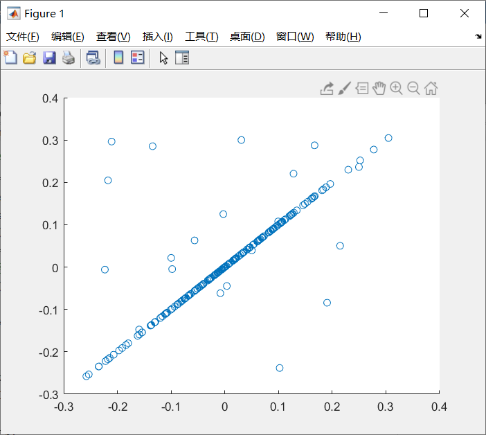
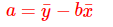
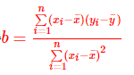
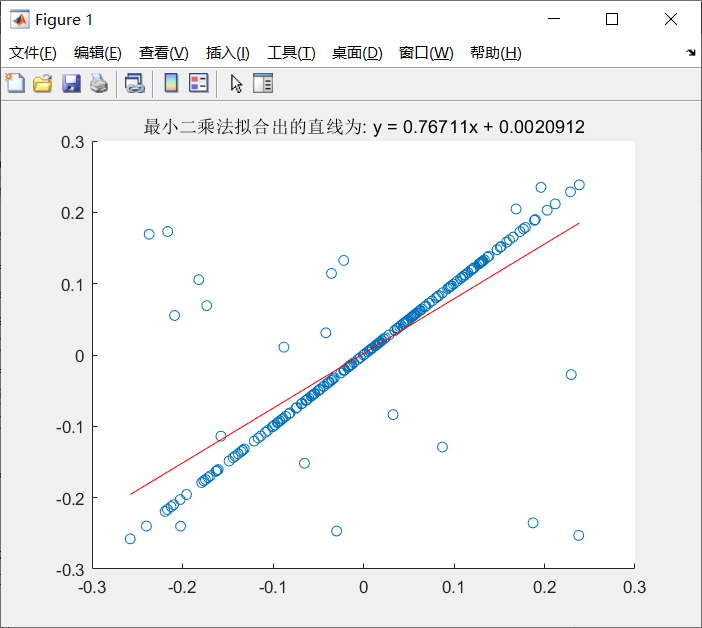
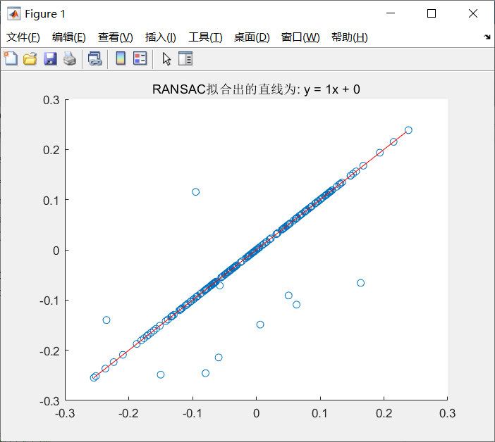
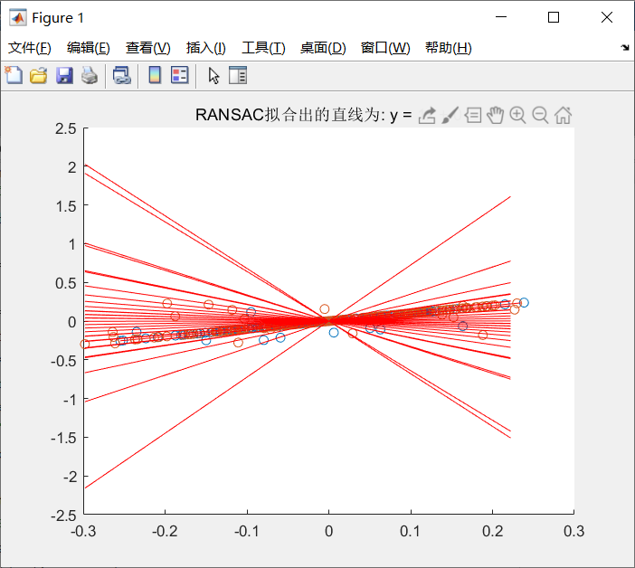
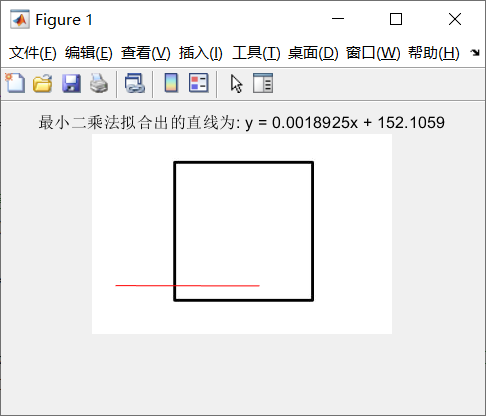
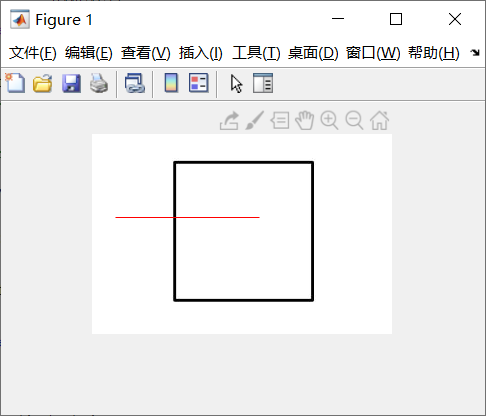
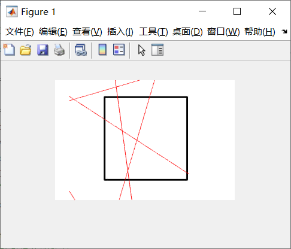

### 											图像处理第三次作业报告    

​												 姓名：杨东谕  学号：3017218173  日期：2019年12月9日

-----

- **LOG算子的推导**
  $$
  \begin{align}
  r^2&=x^2+y^2 \cdots\cdots(1)\\
  G(x,y) &= -e^{-\frac{(x^2+y^2)}{2\sigma^2}}   \cdots\cdots(2)   \\
  \Delta^2f(x,y) &= \frac{\partial f(x,y)}{\partial x^2} + \frac{\partial f(x,y)}{\partial y^2} \cdots\cdots(3)\\
  \nabla^2G(x,y)&=\frac{\partial}{\partial x}(\frac{x}{\sigma ^2}e^{-\frac{x^2+y^2}{2\sigma ^2}})+\frac{\partial}{\partial y}(\frac{y}{\sigma ^2}e^{-\frac{x^2+y^2}{2\sigma ^2}})\\
  &=(\frac{1}{\sigma^2}-\frac{x^2}{\sigma^4})e^{-\frac{x^2+y^2}{2\sigma ^2}}+(\frac{1}{\sigma^2}-\frac{y^2}{\sigma^4})e^{-\frac{x^2+y^2}{2\sigma ^2}}\\
  &=-(\frac{x^2+y^2-2\sigma ^2}{\sigma^4})e^{-\frac{x^2+y^2}{2\sigma ^2}}\\
  &=-[\frac{r^2-\sigma ^2}{\sigma ^4}]e^{-\frac{r^2}{2\sigma ^2}}\cdots\cdots(4)\\
  \end{align}
  $$

- **实现最小二乘法、RANSAC法、霍夫变换法**

  - 对方程y=x， 生成一系列纵坐标符合高斯分布的点，并人工加入outlier_size个outlier，返回各个点的x和y坐标的集合xset和yset

    ```matlab
    function [xset,yset] = createPoints(point_size, outlier_size)
    %生成高斯分布点
    x = normrnd(0,0.1,1,point_size);
    y = x;
    %生成outlier
    outlierX = min(x)+rand(1,outlier_size)*(max(x)-min(x));  %生成x定义域内的outlier
    x = [x, outlierX];
    outlierY = min(y)+rand(1,outlier_size)*(max(y)-min(y));  %生成y值域内的outlier
    y = [y, outlierY];
    xset = x;
    yset = y;
    end
    ```

    结果：(outlier_size = 20, point_size = 200, y = x)

    

  - 最小二乘法

    原理：

    

    

    代码:

    ```matlab
    %生成高斯分布点
    point_size = 200;  %生成点的个数
    outlier_size = 20;
    [x,y] = createPoints(point_size, outlier_size);
    scatter(x,y); hold on;
    point_size = point_size + outlier_size;
    %最小二乘法系数
    x2=sum(x.^2);       % 求Σ(xi^2)
    x1=sum(x);          % 求Σ(xi)
    x1y1=sum(x.*y);     % 求Σ(xi*yi)
    y1=sum(y);          % 求Σ(yi)
    
    a=(point_size * x1y1 - x1*y1)/(point_size*x2 - x1*x1);      %解出直线斜率b=(y1-a*x1)/n
    b=(y1 - a*x1)/ point_size;                      %解出直线截距
    
    new_y = a*x+b;
    plot(x,new_y,'r');
    title(['最小二乘法拟合出的直线为: y = ',num2str(a),'x + ',num2str(b)]);
    ```

    结果：

    

  - RANSAC法

    基本原理：

    （1）要得到一个直线模型，需要两个点唯一确定一个直线方程。所以第一步随机选择两个点。
    （2）通过这两个点，可以计算出这两个点所表示的模型方程y=ax+b。
    （3）将所有的数据点套到这个模型中计算误差。
    （4）找到所有满足误差阈值的点。
    （5）然后我们再重复（1）~（4）这个过程，直到达到一定迭代次数后，选出那个被支持的最多的模  型，作为问题的解。

    代码：

    ```matlab
    data = [x' y']';
    number = point_size + outlier_size;   %所有点的个数
    %RANSAC
    sigma = 1;   %阈值
    pretotal=0;     %符合拟合模型的数据的个数
    n = 100;    %迭代次数
    for i=1:n   
        % 随机选择两个点
        idx = randperm(number,2);
        sample = data(:,idx);
        
        %两组采样点
        x = sample(1,:);
        y = sample(2,:);
    
        k = (y(1)-y(2))/(x(1)-x(2));      %计算直线斜率
        b = y(1) - k*x(1);  %计算直线的截距
        line = [k -1 b];
        mask = abs(line*[data; ones(1,size(data,2))]);    %每个数据到拟合直线的距离
        total = sum(mask < sigma);              %计算数据距离直线小于一定阈值sigma的数据的个数
        if total > pretotal            %找到符合拟合直线数据最多的拟合直线
            pretotal = total;
            bestline = line;          %找到最好的拟合直线
        end
    end
    %显示符合最佳拟合的数据
    mask=abs(bestline*[data; ones(1,size(data,2))])<sigma;    
    k=1;
    for i=1:length(mask)
        if mask(i)
            inliers(1,k) = data(1,i);
            k=k+1;
        end
    end
    %%% 绘制最佳匹配曲线
    bestA = -bestline(1)/bestline(2);
    bestB = -bestline(3)/bestline(2);
    xAxis = min(inliers(1,:)):0.01:max(inliers(1,:)); 
    yAxis = bestA*xAxis + bestB;
    plot(xAxis,yAxis,'r');
    
    title(['RANSAC拟合出的直线为: y = ',num2str(bestA),'x + ',num2str(bestB)]);
    ```

    结果：

    

  - 霍夫变化法

    基本原理：

    （1）随机获取边缘图像上的前景点，映射到极坐标系画曲线；

    （2）当极坐标系里面有交点达到最小投票数，将该点对应x-y坐标系的直线L找出来；

    （3）搜索边缘图像上前景点，在直线L上的点（且点与点之间距离小于maxLineGap的）连成线段，然后这些点全部删除，并且记录该线段的参数（起始点和终止点），当然线段长度要满足最小长度；

    （4）重复（1）（2）（3）

    代码：

    ```matlab
    data = [x;y];
    %霍夫变换过程
    n_max=100;%霍夫空间的纵轴最大值  
    h=zeros(315,2*n_max);  
    theta_i=1; 
    sigma=70;%拟合阈值 
    for theta = 0:0.1:pi
        p=[-sin(theta),cos(theta)];  
        d=p*data;  
        for i=1:point_size+outlier_size  
            %对霍夫空间中的d值进行缩放  
            h(theta_i,round(d(i)/10+n_max))=h(theta_i,round(d(i)/10+n_max))+1;  
        end  
        theta_i=theta_i+1;  
    end
    [theta_x,p]=find(h>sigma);%查找投票数大于sigma的位置
    line_size=size(theta_x);%符合直线条数
    r=(p-n_max)*10;%还原距离R 
    x_line = min(data(:)):0.01:max(data(:)); 
    for i=1:line_size  
        %斜率不存在的情况
        if(abs(cos(theta_x(i)))<0.01)  
            x=r(i);y=-1:1;  
            plot(x,y,'r');  
        else  %斜率存在的情况
            y=tan(theta_x(i))*x_line+r(i)/cos(theta_x(i));
            plot(x_line,y,'r');  
        end  
    end  
    ```

    结果：

    

- **读取图像，使用一阶导数寻找边缘点，使用最小二乘法、RANSAC法、霍夫变换法拟合直线**

  - 使用Roberts算子一阶导数求边缘点

    ```matlab
    f=imread('test.jpg');
    T=100;%阈值
    [m,n]=size(f);
    T = 1;  %阈值
    index = 1;
    %Roberts算子一阶导数求边缘点
    f_r=zeros(m,n);
    for i=2:m-1
        for j=2:n-1
            f_r(i,j)=abs(f(i+1,j+1)-f(i,j))+abs(f(i,j+1)-f(i+1,j));
            if f_r(i,j)<T
                f_r(i,j)=0;
            else
                f_r(i,j)=255;   
                x(index)=i;
                y(index)=j;
                index = index + 1;
            end
        end
    end
    ```

  - 使用最小二乘法

    代码：

    ```matlab
    imshow('test.jpg');hold on;
    point_size = size(x,2);
    
    
    %最小二乘法系数
    x2=sum(x.^2);       % 求Σ(xi^2)
    x1=sum(x);          % 求Σ(xi)
    x1y1=sum(x.*y);     % 求Σ(xi*yi)
    y1=sum(y);          % 求Σ(yi)
    
    a=(point_size * x1y1 - x1*y1)/(point_size*x2 - x1*x1);      %解出直线斜率b=(y1-a*x1)/n
    b=(y1 - a*x1)/ point_size;                      %解出直线截距
    
    new_y = a*x+b;
    plot(x,new_y,'r');
    title(['最小二乘法拟合出的直线为: y = ',num2str(a),'x + ',num2str(b)]);
    ```

    结果：

    

  - 使用RANSAC法

    代码：

    ```matlab
    
    data = [x' y']';
    number = size(x,2);  %所有点的个数
    
    %RANSAC
    sigma = 1;   %阈值
    pretotal=0;     %符合拟合模型的数据的个数
    n = 100;    %迭代次数
    
    for i=1:n   
        % 随机选择两个点
        idx = randperm(number,2);
        sample = data(:,idx);
        
        %两组采样点
        x = sample(1,:);
        y = sample(2,:);
    
        k = (y(1)-y(2))/(x(1)-x(2));      %计算直线斜率
        b = y(1) - k*x(1);  %计算直线的截距
        line = [k -1 b];
    
        mask = abs(line*[data; ones(1,size(data,2))]);    %每个数据到拟合直线的距离
        total = sum(mask < sigma);              %计算数据距离直线小于一定阈值sigma的数据的个数
    
        if total > pretotal            %找到符合拟合直线数据最多的拟合直线
            pretotal = total;
            bestline = line;          %找到最好的拟合直线
        end
    end
    %显示符合最佳拟合的数据
    mask=abs(bestline*[data; ones(1,size(data,2))])<sigma;    
    k=1;
    for i=1:length(mask)
        if mask(i)
            inliers(1,k) = data(1,i);
            k=k+1;
        end
    end
    
    %%% 绘制最佳匹配曲线
    bestA = -bestline(1)/bestline(2);
    bestB = -bestline(3)/bestline(2);
    xAxis = min(inliers(1,:)):0.01:max(inliers(1,:)); 
    yAxis = bestA*xAxis + bestB;
    plot(xAxis,yAxis,'r');
    ```

    结果：

    

  - 使用Hough变化

    代码：

    ```matlab
    imshow('test.jpg');hold on;
    point_size = size(x,2);
    data = [x;y];
    
    %霍夫变换过程
    
    n_max=100;%霍夫空间的纵轴最大值  
    h=zeros(315,2*n_max);  
    theta_i=1; 
    sigma=70;%拟合阈值 
    for theta = 0:0.1:pi
        p=[-sin(theta),cos(theta)];  
        d=p*data;  
        for i=1:point_size  
            %对霍夫空间中的d值进行缩放  
            h(theta_i,round(d(i)/10+n_max))=h(theta_i,round(d(i)/10+n_max))+1;  
        end  
        theta_i=theta_i+1;  
    end
    [theta_x,p]=find(h>sigma);%查找投票数大于sigma的位置
    line_size=size(theta_x);%符合直线条数
    r=(p-n_max)*10;%还原距离R 
    x_line = min(data(:)):0.01:max(data(:)); 
    for i=1:40:line_size  
        %斜率不存在的情况
        if(abs(cos(theta_x(i)))<0.01)  
            x=r(i);y=-1:1;  
            plot(x,y,'r');  
        else  %斜率存在的情况
            y=tan(theta_x(i))*x_line+r(i)/cos(theta_x(i));
            plot(x_line,y,'r');  
        end  
    end  
    ```

    结果：

    